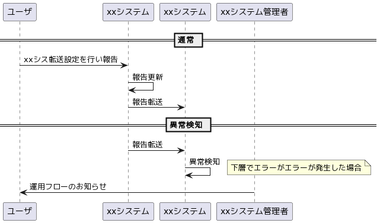

## 用途
各種フロー図の作成

## 環境構築
[Visual Studio Code で UML を描こう！](https://qiita.com/couzie/items/9dedb834c5aff09ea7b2)

## サンプルコード

```
@startuml PlantUMLサンプル
participant ユーザ as U
participant xxアプリ as AP 
participant xxシステム as SIS 
participant xxシステム管理者 as SISM

== 通常 ==
U -> AP: xxシス転送設定を行い連絡
AP -> AP: 連絡情報更新
AP -> SIS: 連絡転送

== 異常検知 ==
AP -> SIS: 連絡転送
SIS -> SIS: 異常検知
note right
下層でエラーがエラーが発生した場合
end note
SISM -> U: 運用フローのお知らせ
@enduml
```

## 参照
[PlantUML](https://plantuml.com/ja/)